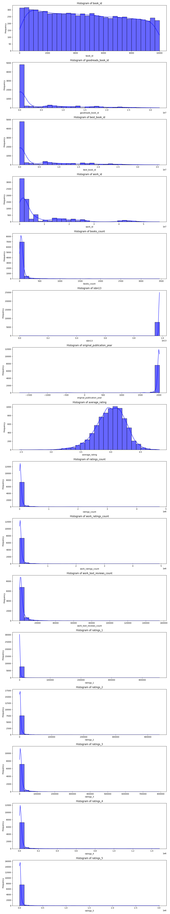

# Analyzing the World of Books: Insights from a Comprehensive Dataset 

In an age where literature transcends the realms of paper and ink, the digital repository of books has become a treasure trove of insights waiting to be unraveled. With over 10,000 book entries to investigate, this analysis offers a closer look at the nuances of authorship, ratings, and publication trends. Whether you’re a reader, an author, or a publishing stakeholder, understanding these dynamics can profoundly influence strategies for engagement and success in the literary market. 

## Summary of Findings

This analysis of a comprehensive dataset reveals several notable trends and statistical highlights:

- **Authors and Popularity**: The dataset includes works by 4,664 unique authors, with Stephen King leading the pack, having 60 titles in the dataset. 
- **Publication Trends**: The average original publication year is around 1982, indicating a wealth of modern literature. The oldest book dates back to 1750, reflecting the rich history of literature.
- **Ratings Overview**: The average rating across books is robust at 4.00, but significant variation exists, evidenced by a standard deviation of 0.25, indicating a spectrum of reader satisfaction.
- **Engagement Metrics**: On average, books receive 54,001 ratings, with a substantial range of reader reviews skewing towards the higher end, suggesting both popularity and reader engagement.
- **Outlier Detection**: The data identified 393 outliers, indicating certain books significantly deviating from the norm, whether due to extreme ratings or unique publication histories.

## In-Depth Analysis

### Methodologies Used 

Data analysis risked becoming an exercise in futility without a clear methodological path. The dataset underwent a rigorous process of cleaning, exploring patterns through correlation matrices, and running regression analyses for predictive insights. 

1. **Descriptive Statistics**: Metrics such as mean, median, and standard deviation were calculated for various attributes. For instance, the average number of ratings per book (54,001) suggests high engagement among readers.
  
2. **Correlation Analysis**: The correlation matrix provided insights into how different variables interrelate. A strong negative correlation was found between `ratings_count` and both `books_count` and `work_text_reviews_count`, implying the potential for an inverse relationship between the quantity of books by an author and their ratings.

3. **Regression Analysis**: A regression model was constructed with `work_ratings_count` as the dependent variable. Notably, `work_ratings_count` had a high feature importance score (0.600), highlighting its influence on predicting a book's rating outcome.

### Key Insights

1. **Trends in Publishing**: With a mean original publication year peaking in 1982, it suggests a strong engagement with modern literary trends while tracking older works helps bibliophiles connect with a broader reading experience. 

2. **Author Impact**: Authors with higher `books_count` (average at 75) do not necessarily translate to higher ratings. This indicates the market's preference for quality over quantity. Veteran authors may not match the excitement of debut writers, who capture readers’ attention with fresh narratives.

3. **Rating Dynamics**: The high average rating combined with varying engagement levels revealed a generally favorable reception but highlighted the necessity for deeper reader insights. Investigating sentiments in text reviews could unearth the ‘why’ behind numerical ratings.

## Implications for Stakeholders 

The findings of this analysis hold substantial relevance for various stakeholders within the literary ecosystem:

- **Authors**: Novelists should prioritize quality content over sheer volume. Focused strategies towards engaging readers post-publication could enhance their work’s visibility and longevity. 

- **Publishers**: Understanding reader preferences highlighted in ratings and reviews can shape editorial choices. The correlation between reader engagement and publication timing should guide marketing strategies, especially for new authors.

- **Readers**: The data serves as a reminder that while popular opinion matters, exploring lesser-known titles may unveil hidden gems. Curated lists driving readers to critically acclaimed but less popular books can create richer reading experiences.

## Thought-Provoking Conclusion 

This analysis delves deep into the fabric of literary dynamics. 

### Key Takeaways:

- A proactive approach toward understanding authorship and reader engagement emerges as essential for success.
- The interplay between quantity and quality enhanced by time reveals the complexity inherent in reader preferences.

Looking forward, we must ask: 
- How can emerging authors harness this data to shape their literary journeys in a saturated market?
- What further variables could influence future analyses, such as genre-specific trends or the role of social media in shaping reader behaviors?

As we explore the world of books beyond statistics, the potential for informed decision-making and enriched literary engagement evolves, beckoning all stakeholders to dive deeper into the narratives that shape our reading lives.

## Visualizations

