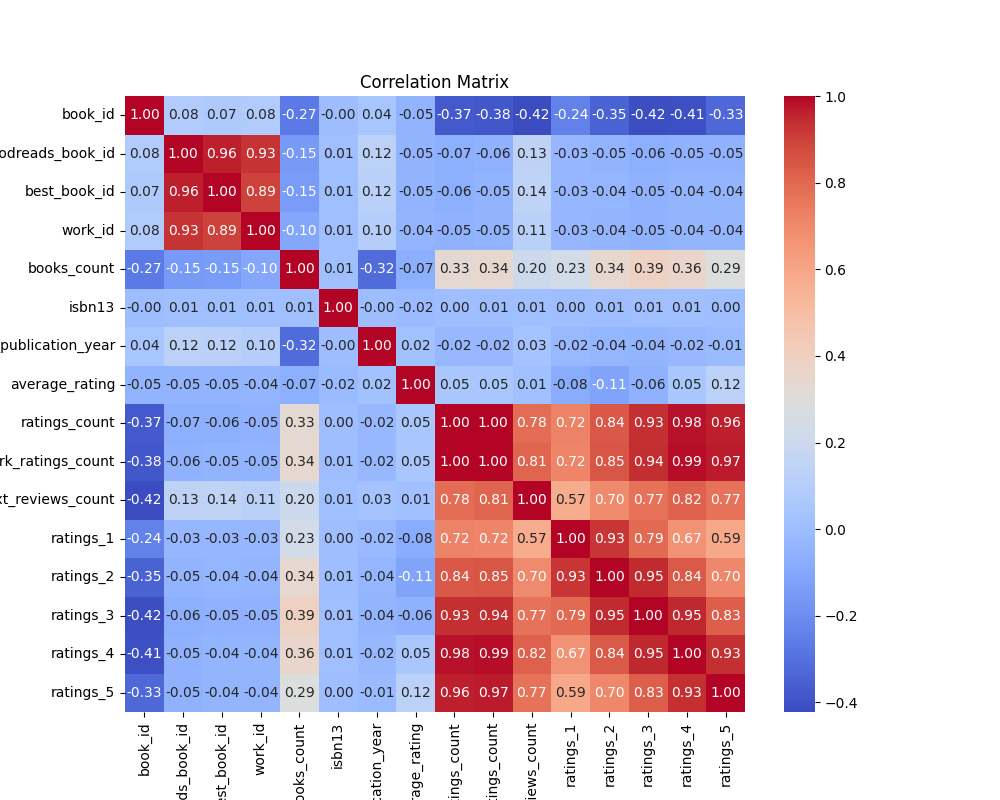

# Unveiling Insights from a Comprehensive Dataset on Books: A Detailed Analysis

In a world swamped by an abundance of literature, distinguishing between bestsellers and hidden gems can be a daunting task. However, thanks to advancements in data analysis, we can now glean insights from massive datasets related to books. The following narrative provides a thorough exploration of a dataset comprising 10,000 book entries, revealing fascinating findings that can guide authors, publishers, and readers alike.

## Summary of Findings

The dataset yields a wealth of information with notable statistics:
- **Average Rating**: 4.00, indicating general satisfaction among readers.
- **Most Common Author**: Stephen King, with 60 entries, highlighting his prolific presence in the literary world.
- **Publication Years**: The average publication date trends towards the early 1980s, with some books dating back to 1750.

The findings draw attention to the metrics that matter most, from ratings to publication years, illustrating potential trends in literature.

## Detailed Analysis

### Key Statistics
- **Books Count**:
  - **Median**: 40 books per author exists in the dataset, with a notable outlier having 3455 entries, suggesting a significant variance among authors.
  
- **Ratings Overview**:
  - **Average Ratings**: Most books fall within a strong rating range of 2.47 to 4.82 across five categories, with the highest rating (5 stars) averaging nearly 24,000.
  - **Ratings Count**: A strong correlation exists between higher average ratings and higher ratings counts.

### Correlation Insights 
The analysis demonstrates significant correlations:
- **Negative Correlations with Ratings Count**: 
  - Ratings, specifically **work ratings count (-0.382)** and **ratings count (-0.373)**, are significantly linked, suggesting that as the number of ratings increases, the ratings tend to stabilize or turn less diverse.

### Outliers
Outliers detected (393 in total) show that a small number of books attract disproportionately high attention, indicating the potential for classic titles or exceptionally marketed works that drive higher engagement.

## Insights Gained

The dataset reveals several pertinent insights:
- **Prolific Authors Thrive**: Notable authors like Stephen King continue to dominate literary circles, emphasizing the importance of established names in attracting readership.
- **Ratings Play a Critical Role**: Higher ratings are associated with greater volume in ratings, underscoring the importance of generating critical feedback and critique to bolster a book’s market presence.

### Geographic Data Insights
While the dataset lacks geographic coordinates, the diversity of language codes (25 unique codes) illuminates a broad international readership, suggesting global themes resonate with audiences.

## Implications for Stakeholders

### Authors
Authors can leverage this data to understand which genres or themes resonate with readers. Engaging with readers for feedback is crucial, as ratings significantly impact a book's visibility.

### Publishers
Publishers can focus on authors with proven track records while also investing in emerging talents. The analysis of ratings can guide marketing strategies and help target audiences effectively.

### Readers
For readers, this dataset provides a curated insight into popular and well-rated contemporary literature. Armed with such analysis, readers can discover new favorites rooted in past successes.

## Conclusion: The Future of Books and Data

In conclusion, analyzing datasets like this not only enriches our understanding of literary trends but also fosters informed decision-making among writers, publishers, and bibliophiles. As the landscape of literature continually evolves, leveraging analytical insights will empower stakeholders to navigate the complexities of the book market effectively.

### Food for Thought
As we embrace the age of information, how will the intersection of literature and data analytics shape future reading experiences? Will we one day depend solely on algorithms to curate our reading lists, or will the human touch of literacy always reign supreme? The answers lie within the pages yet unwritten.

## Visualizations

