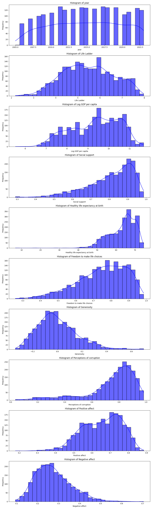

# Exploring the Happiness Factors in Global Quality of Life: A Data Analysis Narrative

In an increasingly interconnected world, the measure of happiness transcends mere economic indicators. The intricacies of well-being encompass emotional states, social structures, and personal freedoms. This analysis dives deep into a dataset spanning 2363 entries across 165 countries, analyzing various determinants influencing life satisfaction—from economic conditions to social support systems. By distilling this information, we aim to unveil critical patterns and insights that can serve stakeholders in policy-making, business, and community development.

## Summary of Findings

- **Key Variables Analyzed**: Life Ladder (happiness score), Log GDP per capita, Social Support, Healthy Life Expectancy at Birth, Freedom to Make Life Choices, Generosity, Perceptions of Corruption, Positive Affect, Negative Affect.
- **Demographics**: The dominant country represented is Argentina with 18 entries.
- **Average Life Ladder Score**: 5.48, highlighting moderate levels of reported happiness across the dataset.
- **Correlations**: Significant positive correlations exist between Life Ladder and Log GDP per capita (0.78), Social Support (0.72), and Healthy Life Expectancy (0.71), while perceptions of corruption exhibit a negative correlation (-0.43).

## Detailed Analysis

### Statistical Overview

The dataset exhibits the following key statistics:

- **Life Ladder**: Mean = 5.48, demonstrating that, on average, individuals report moderate happiness. The variation spans from 1.281 to 8.019.
- **Log GDP per Capita**: Mean = 9.40, indicating robust economic indicators suggestive of wealth distribution.
- **Freedom**: Averaging at 0.75, this highlights a substantial sense of agency among respondents.
- **Healthy Life expectancy**: The average is a commendable 63.4 years, reflecting a decent standard of health and wellness.

#### Missing Values
The dataset contains missing data in multiple fields, most notably in ‘Generosity’ and ‘Perceptions of Corruption,’ which were missing in 81 and 125 entries respectively, emphasizing areas where data completeness can be improved.

### Correlation Insights

A detailed examination of the correlation matrix reveals several strong relationships:

- **Log GDP per Capita and Life Ladder**: Strongest correlation suggesting that increased economic wealth contributes significantly to perceived life satisfaction.
- **Positive Affect and Life Ladder**: Indicates that emotional well-being substantially influences overall happiness.

### Regression Analysis

The regression analysis produced a coefficient reflecting the weighted contribution of each factor towards life satisfaction. Notably:

- **Feature Importance**: Social Support emerged as the most significant positive contributor to happiness, reinforcing the importance of community and relationships.
- **Negative Affect**: Conversely, high levels of negative emotions correlate strongly with lower happiness scores.

## Insights Gained

This analytical exercise reinforces the understanding that happiness is a multi-dimensional construct influenced by both emotional and environmental factors. Key insights include:

1. **Economic Growth is Not Enough**: While GDP plays a significant role, the emotional and social factors such as support structures, personal freedom, and health are equally critical.
2. **Community Matters**: Countries with robust social support networks show a strong positive correlation with happiness, emphasizing the need for communal investments.
3. **Perception of Corruption**: Notably influences happiness, bringing forth the importance of transparent governmental practices.

## Implications for Stakeholders

- **Policy Makers**: This analysis highlights the need for holistic policies that address not only economic factors but also social well-being, mental health support, and governance integrity.
- **Businesses**: Organizations can benefit from understanding these dynamics to foster workplace cultures that enhance employee happiness through social engagement and mental health initiatives.
- **NGOs and Community Organizations**: Leveraging insights on social support can aid in designing effective programs aimed at boosting community ties and overall happiness.

## Conclusion

In a world increasingly seeking to measure the unmeasurable, our understanding of the nuances of happiness becomes paramount. This analysis underscores that happiness is multifaceted, requiring concerted efforts to enhance social structures alongside economic frameworks. As stakeholders like governments, businesses, and community organizations engage with these insights, the potential to foster a more satisfied and healthier global population becomes an attainable goal. In the end, fostering happiness is not merely a personal journey but a collective mission that benefits all facets of society. 

Let us continue to ask: how can we further integrate these insights into actionable strategies to create better living conditions and happiness for future generations?

## Visualizations

