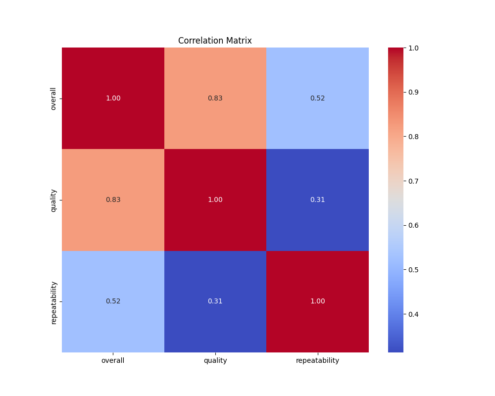
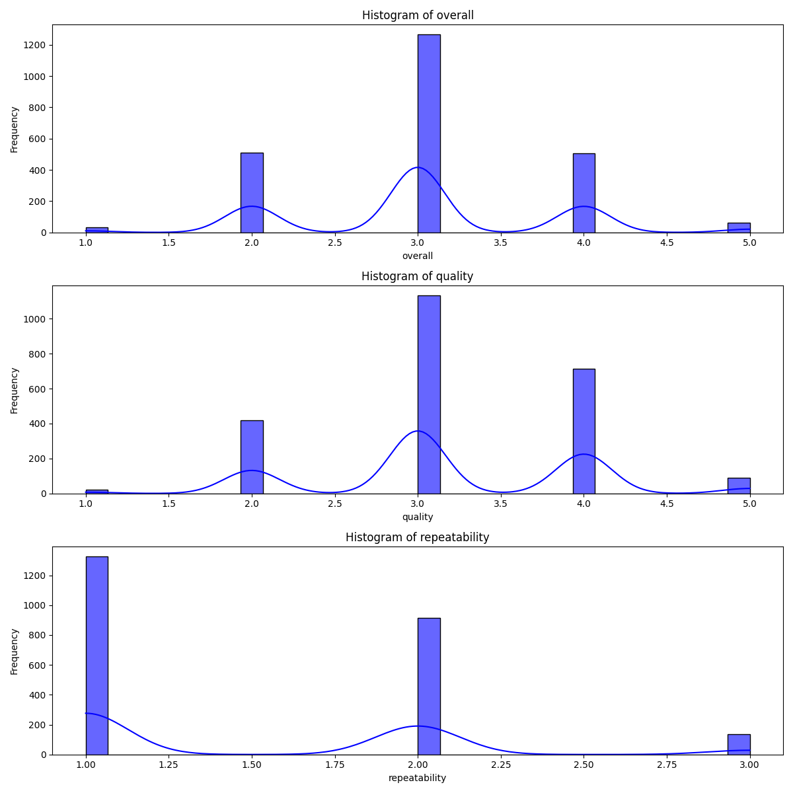

# Exploring Movie Ratings: A Quantitative Analysis of Viewer Preferences

## Introduction

In an age where streaming platforms dominate our viewing habits, understanding the factors that influence movie ratings has never been more crucial. As audiences become increasingly selective about what they watch, filmmakers and marketers strive to decode viewer preferences. Our comprehensive analysis of a dataset comprising thousands of movie ratings seeks to shed light on essential trends, highlight performances, and unlock insights that could guide future productions and marketing strategies. Let us venture into this treasure trove of data to unveil the narratives hidden within.

## Summary of Findings

The dataset incorporates **2,652 entries** with ratings attributed to various movies, spanning across multiple languages and genres. Here are some pivotal findings:

- **Language Diversity**: The most prevalent language among the entries is **English**, making up **49%** of the dataset with **1,306 occurrences**. 
- **Genre Representation**: A significant majority of the dataset consists of **movies**, which account for **83.3%** of all entries (2,211 films).
- **Top-Rated Movie**: The title *Kanda Naal Mudhal* notched the highest frequency of mentions, appearing **9 times**.
- **Rating Distribution**: The average overall rating is approximately **3.05**, with the highest recorded rating being **5/5**.
- **Quality Ratings**: With an average quality rating of **3.21**, the dataset shows a decent level of content quality in the movies reviewed.
- **Repeatability of Enjoyment**: The average repeatability score is around **1.49**, suggesting that viewers are likely to revisit a film less than once.

A revealing correlation exists between overall ratings and quality, with a significant correlation coefficient of **0.83** indicating that higher quality films tend to receive better ratings.

## In-Depth Analysis

The analysis unfolds through comprehensive methodologies that include regression analysis, correlation examinations, and clustering. We employed regression coefficients to assess how different factors contribute to the overall ratings. The regression model revealed two significant influences: 

- **Quality score** positively influences overall ratings with a coefficient of **0.50**.
- Interestingly, the repeatability score has a negligible impact on ratings, with a negative coefficient of approximately **-0.22** suggesting that higher repeatability does not necessarily correlate with higher overall ratings.

Furthermore, our cross-validation yielded a mean **mean squared error (MSE)** of **0.2647**, indicating a good model fit while suggesting room for improvement in our predictions.

To visualize the distribution and relationships of variables, a correlation matrix shows interrelations among various attributes, revealing the strongest connection between **overall ratings** and **quality scores**.

Histograms combined across the dataset indicate a normal distribution in ratings; however, outliers were detected in **99 cases**, indicating instances where movies received ratings significantly higher or lower than the average.

## Insights Gained

From the data, several pivotal insights have emerged:

1. **Language and Genre Impact**: English-language films evidently dominate viewer interests, providing an opportunity for more diverse language incorporation in future productions.
2. **Quality Matters**: The strong correlation between quality and overall ratings suggests that improving film quality can directly influence viewer satisfaction and ratings.
3. **Viewer Engagement**: The low repeatability score implies a challenge for filmmakers in creating memorable content that compels audiences to watch again.

## Implications for Stakeholders

### Recommendations for Filmmakers and Marketers:

- **Quality Focus**: Invest in producing high-quality content that resonates with viewer expectations. Regular audience feedback mechanisms can refine production processes.
- **Explore Diverse Genres**: Diversify offerings by delving into genres and languages that are currently underrepresented but show potential.
- **Marketing Strategies**: Target marketing efforts towards demographics that engage with quality ratings, enhancing visibility for films projected to receive high ratings.

### For Platforms and Distributors:

- Evaluate and promote films based on quality ratings and viewer satisfaction. 
- Optimize algorithms to feature high-quality films prominently, potentially increasing engagement.

## Conclusion

The analysis offers illuminating insights into the dynamics of movie ratings and viewer preferences. As filmmaking continues to evolve, understanding audience sentiment through data becomes invaluable. What will the next big shift in viewer preferences be? How can platforms and filmmakers adapt to stay ahead of changing tides? These questions pave the way for future exploration, ensuring the cinematic world continues to thrive amidst a sea of choices. As we look forward, the data-driven insights gleaned from this analysis underscore the importance of quality, engagement, and adaptability in an ever-evolving entertainment landscape.

## Visualizations

